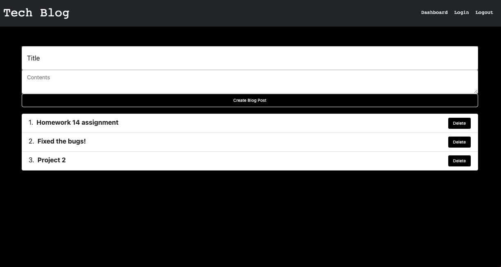

# TECH BLOG

This week's task was to build a CMS-style blog site similar to a Wordpress site, where developers can publish their blog posts and comment on other developers’ posts as well. I had to build this site completely from scratch and deploy it to Heroku. My app follows the MVC paradigm in its architectural structure, using Handlebars.js as the templating language, Sequelize as the ORM, and the express-session npm package for authentication.

# USER STORY

AS A developer who writes about tech   
I WANT a CMS-style blog site   
SO THAT I can publish articles, blog posts, and my thoughts and opinions   

# TECH USED:

1. Bcyrpt
2. MySQL2
3. Dotenv
4. Sequelize
5. JavaScript
6. Node.js
7. Express.js
8. Handlebars
9. Express-session
10. Connect-session

# APPLICATION LINK:

https://fast-plateau-75151.herokuapp.com/

